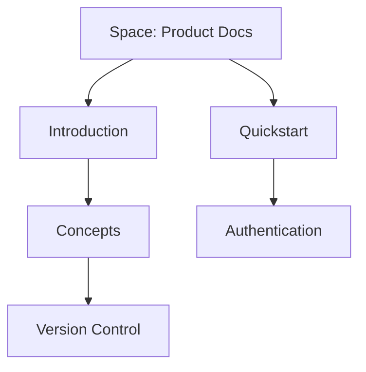

## Overview

PORMAZION organizes your project documentation into structured, collaborative spaces. You create spaces to group related docs, build pages with rich content, and manage hierarchies for intuitive navigation. Grasp these concepts to streamline your workflow and scale documentation effectively.

<Columns cols={3}>
  <Card title="Documentation Spaces" icon="folder" href="#documentation-spaces">
    Central hubs for your docs.
  </Card>
  <Card title="Page Types" icon="file-text" href="#page-types">
    Flexible content structures.
  </Card>
  <Card title="Hierarchy" icon="layout" href="#hierarchy">
    Organize for discoverability.
  </Card>
</Columns>

## Documentation Spaces

Documentation spaces act as top-level containers in PORMAZION. You use them to separate docs by project, team, or topic—for example, one space for API references and another for user guides.

Each space includes settings for permissions, themes, and integrations. Create a space via the dashboard at `https://dashboard.example.com/spaces/new`.

<Callout kind="tip">
  Start with broad spaces like "Product Docs" and refine as your project grows.
</Callout>

## Page Types and Content Structures

PORMAZION supports various page types to match your content needs.

<Tabs>
  <Tab title="Markdown Pages" icon="edit-3">
    Standard pages for prose, code, and embeds. Use MDX for components like `<Callout>` and `<Steps>`.
  </Tab>
  <Tab title="API Reference Pages" icon="code">
    Auto-generated from OpenAPI specs. Include `<Request>` and `<Response>` components for examples.
  </Tab>
  <Tab title="Changelog Pages" icon="git-branch">
    Use `<Update>` components to list releases with tags like `{"feature"}`.
  </Tab>
</Tabs>

## Hierarchy and Organization Principles

Build a clear hierarchy to help users navigate. Start with spaces at the root, then nest pages and subpages.



Follow these principles:
- Limit nesting to three levels.
- Use frontmatter for metadata: `title` and `description`.
- Link internally with `/concepts#hierarchy`.

<Steps>
  <Step title="Create Root Page" icon="file-plus">
    Add your landing page in the space.
  </Step>
  <Step title="Nest Subpages" icon="chevron-down">
    Drag pages into folders or use sidebar nesting.
  </Step>
  <Step title="Set Navigation" icon="menu">
    Configure sidebar order via space settings.
  </Step>
</Steps>

## Version Control Basics for Docs

PORMAZION integrates with Git for version control. Connect your repo to track changes, preview branches, and publish from main.

<CodeGroup tabs="GitHub, GitLab">
  ```yaml
  # .pormazion.yml in repo root
  spaces:
    - name: "Product Docs"
      branch: "main"
      path: "docs/"
  ```
  ```yaml
  # GitLab CI example
  deploy_docs:
    script:
      - pormazion deploy --space "Product Docs"
  ```
</CodeGroup>

Commit changes with meaningful messages, like "docs: add concepts page". Merge previews let you review before publishing.

<Expandable title="Advanced Git Settings" default-open="false">
  Customize webhooks for CI/CD:

  ```bash
  curl -X POST https://api.example.com/webhooks/git \
    -H "Authorization: Bearer YOUR_TOKEN" \
    -d '{"repo": "your/repo", "events": ["push"]}'
  ```
</Expandable>

## Collaboration Workflows Overview

Invite team members with role-based access: Viewer, Editor, Admin. Use comments, @mentions, and real-time editing.

<Callout kind="info">
  Enable version history in space settings to revert changes easily.
</Callout>

Workflow example:
1. Editor drafts a page.
2. Admin reviews and publishes.
3. Viewers access the live version.

This structure ensures secure, efficient collaboration across your team.